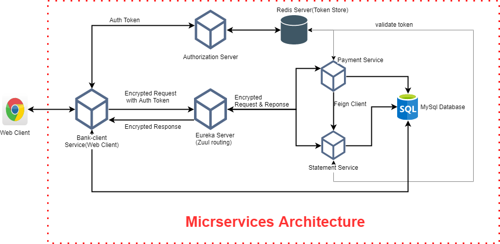

# Bank-services
Demo Online Bank Application with microservices architecture on HTTPS and docker support

# Background : 
In this application we are demonstarting a simple application with simple transction but using micro-services architecture, 
which demonstartes service to service comunication using Feign Client  and external service comunication using Zuul Routing.   Also the micro service resources are protected with Bearer Token
for this we have created a seprated Authorixation service which issues the token based on valid clientId & clientSecret and this token are stored in RedisTokenStore for verfiation.
  
This application is supported on HTTP's currently with self signed certificate, so you may get a security warning on browser after starting the application.
  
This application is also supported with Docker read the below instruction how to run application on docker. 

# Tools & Framwework Used:
- Redis 
- MySql 
- Maven 
- LogBook 
- Spring Framework(Spring MVC, Spring Security, Spring OAuth , Spring Data JPA) 
- Logback 
- Mockito,Junit & hamcrest for Testing 
- Docker / Docker Toolbox

# Architecture

# Instruction to run project:

Please follow the below instructions carefully to run the project.

## Running on LocalHost Machine:
#### Note: Don't change the Profile Id.

1. Prerequsite : 
   - Redis running on the machine. 
   - Mysql Database running on the machine.
   - mvn installed.
     
2. Update Bank-Services main POM under DEV Profile
   1. Redis :
 	  - For Redis there are two properties (**redis.ip) & (redis.port**) , please update if you have changed from default as of now it is configured with default values.
   2. MySql :
 	  - Update DB Related details based on your configuration (url, username & password).

3. Open CMD and run the command **mvn clean install -PDEV** or if you want to skip Test then **mvn clean install -PDEV -DskipTests**

4. You should check target folder all the Jar's has been created now we need to run the Jars using cmd(**java -jar <Jarname.jar> e.g java -jar authorization-1.0.0.jar**)

5. Preferred Order for running the Jar's
   - Eureka-Server Jar
   - Authorization Jar
   - Payment Jar
   - Statement Jar
   - Bank-Client Jar
   
6. After all are successfully Running check the below URL's:
   - https://localhost:8301  You should see Erueka page running and instances are showing the for Authorization, Payment & Statement.
   - https://localhost:8081  You should see SignIn and SignUp page first you need to Signup with details and then SignIn with userName and 	Password

## Running on Docker :

#### Note: HTTPS is disabled because of Self Signed Certificate so URL's are on http

1. Prerequsite : 
   - Docker Desktop or Docker ToolBox Installed and Running(check on cmd type **docker --version**)
   - Good Internet connectivity as Redis & Mysql Images will be downloaded.
   - mvn installed.
     
2. Open command prompt and go to Bank-services location 
   1. Run (**mvn clean install -PDOCKER -DskipTests**), This will generate JAR's in target folder.
   2. Run (**docker-compose up --build**)
   3. This will Take as the images will be downloaded if not present and will start Mysql as docker container.
   
3. After all are successfully Running check the below URL's check Below for **Docker Desktop**:
   - http://localhost:8301  You should see Erueka page running and instances are showing the for Authroization, Payment & Statement.
   - http://localhost:8081  You should see SignIn and SignUp page first you need to Signup with details and then SignIn with username and Password
   
4. After all are successfully Running check the below URL's check Below for **Docker ToolBox**:
   - Open cmd check Docker machine Ip (docker-machine ip), this will return Ip which we have to use to access our application.
   - http://docker-machine-ip:8301  You should see Erueka page running and instances are showing the for Authroization, Payment & Statement.
   - http://docker-machine-ip:8081  You should see SignIn and SignUp page first you need to Signup with details and then SignIn with userName and 	Password
